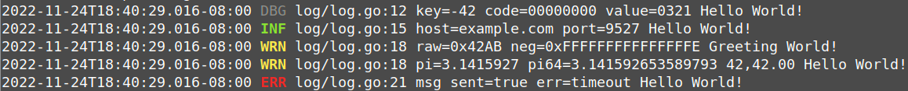

# FLog: Naive **F**ixed **Log** in Golang
  - A strongly-opinionated key-value stylish log library, zero-configuration (un-configurable)
  - 这是一个带有强烈个人观点的简单日志库, KV风格，零配置（不可配置）
  

# Usage 用法

  - `import "flog/log"`，not `import "flog"`
  ```go
  import "flog/log"

  log.Debug().Int("key", -42).IntPad0("code", 0, 8).UintPad0("value", 321, 4).Msg("Hello World!")
  log.Info().Str("host", "example.com").Uint("port", 9527).Msg("Hello World!")
  log.Warn().Hex("raw", 0x42ab).Hex("neg", -2).Msgf("Greeting %s!", "World")

  // shorthand
  log.Infof("Hello %s!", "World!") // same as `log.Info().Msgf(...)`
  ```

  - must call finishing methods (i.e. `Msg/Msgf`) to actually print the log
  - supported types (hope one day Go type-parameterized method works, revise them as several generic functions):
    - Bool, Str
    - Int, Int8, Int16, Int32, Int64 (waiting for `Int[T ~Int|~Int8|...](k string, v T)`)
    - Uint, Uint8, Uint16, Uint32, Uint64
    - Float32, Float64
    - Err
    - Any

# Why 为什么
  - Most configurations are fixed in daily work (at least in the same company we intented to unify log configurations): log format, time format and other things
  - 日常工作中，日志的绝大部分配置是固定、统一的（一个开发团队中至少应该统一日志格式及其使用方式）：比如日志格式、日期格式等
  - zap is too complicated/free, and zerolog is json-intimated
  - zap配置太复杂/灵活，而zerolog简单但是以json为主
  - use fixed/hardcoded logic may be helpful for performance
  - 使用固定/硬编码的逻辑，可能会有更好的性能

# I need feature XXX 我需要xxx功能
  - copy to codebase, e.g. under `pkg/flog` & modify by yourself :smirk:
  - 自己动手，丰衣足食，把flog模块放到自己的工程里去，比如`pkg/flog`，然后修改就完了

# Philosophy 哲学
  - [12factor on logs](https://12factor.net/logs)
    > should not attempt to write to or manage logfiles. Instead, each running process writes its event stream, unbuffered, to **stdout**
  - [12factor关于日志部分](https://12factor.net/zh_cn/logs)
    > 不应该试图去写或者管理日志文件。相反，每一个运行的进程不用缓冲，直接写事件流到标准输出（**stdout**）
  - In most scenarios, app is running as a systemctl service or docker container, which has alread take care of our logs, managing logs by app itself is redundant.
  - 在绝大多数场景下，app作为一个systemctl的服务或者docker容器运行，外部环境/服务已经管理好我们的日志了（通过重定向标准输出），自己管理日志通常是多此一举
  - If you really want to write log files and rotate, better to do it by other tools through pipe, which meets [The UNIX Philosophy](https://en.wikipedia.org/wiki/Unix_philosophy) e.g.
  - 如果你需要将日志写到文件中并滚动起来，更好的办法是写一个专门的应用，并通过管道去使用，这也符合UNIX哲学，比如：
    ```bash
	$ my_app | tee logToFiles -d /var/logs/my_app/ --rotate-size 1m --files-keep 5
	$ other_app | tee sendToKafka -c config.yml
	  ```

# How 如何实现
  - `copy(dst , src []byte)`
  - cache time for print only seconds/milliseconds part
  - reduce/eliminate memory allocations
  - reuse buffer: pre-allocated buffer & `sync.Pool`
  - replace `printf("%d", int)` with efficient integer to string conversions, by Matthew Wilson, and refer `strconv.Append...`

# TODO
  - support `Map` to print all KV directly?
  - Hex for negative values: `Printf("%#08x", -0xbad) == "-0x00bad"`
